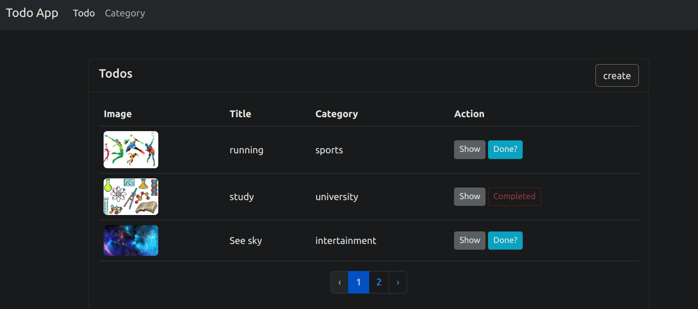

# Todo Task Manager Web App by Laravel

In this application you can manage your Todo tasks.
For using this app you should **register** at first then **login**.
You can create, update, delete categories (**CRUD**) and also todo task with image. status of task can be change by clicking on 'doing...' button to 'completed'. 
In addition, pagination for list of task is provided.
This app written as long as learning laravel from https://webprog.io.

